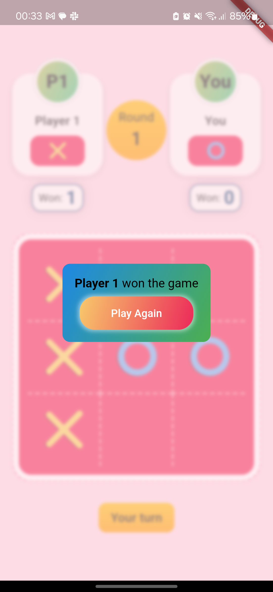

# Tic Tac Toe Multiplayer App

## Overview

This is a multiplayer Tic Tac Toe app developed using Flutter, Node.js, and Socket.io. It allows users to play the classic game of Tic Tac Toe with their friends in real-time. The app provides features such as creating or joining rooms, joining via randomized room IDs or QR codes, and the option to rematch for continuous gameplay.

## Features

- **Multiplayer Gameplay**: Users can play Tic Tac Toe with their friends in real-time.
- **Create or Join Rooms**: Players can create their own rooms or join existing ones.
- **Randomized Room IDs**: Rooms can be accessed via randomized room IDs for easy joining.
- **QR Code Joining**: Alternatively, users can join rooms by scanning QR codes.
- **Rematch Option**: Players have the option to rematch for continuous gameplay.
  
## Screenshots

        
        &nbsp;
        
        &nbsp;
        
        &nbsp;
        

## Technologies Used

- **Flutter**: Frontend development framework for building the mobile app.
- **Node.js**: Backend server for managing game rooms and player connections.
- **Socket io**: Real-time engine for bi-directional communication between clients and server.
- **Riverpod**: State management library used in Flutter for efficient state management.

## How to Run

1. Clone this repository.
2. Navigate to the project directory.
3. Create a `.env` file in the root directory.
4. Add the following line to the `.env` file: `URL=https://tic-tac-toe-backend-nyoi.onrender.com`.
5. Run `flutter pub get` to install dependencies.
6. Run the app using `flutter run`
